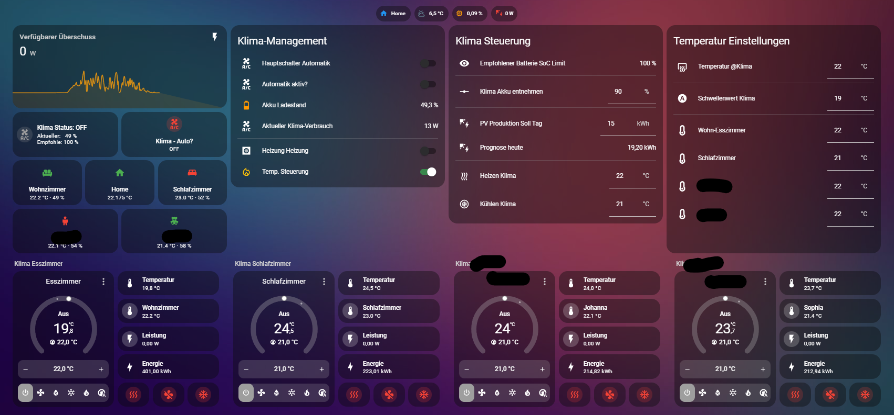

# Klima-Heizung-Steuerung

 Dieses Projekt optimiert mein Heiz- und Kühlverhalten meiner Heinzung mit zusammen spiel meiner Klimaanlage,
 mit Home Assistant.

## Hardware-Kontext

* **Zentrale:** Home Assistant (Beelink Mini S13, Intel N150)
* **Heizung:** Vaillant VC 126/2-C, VRC 410, Shelly mini 1 gen3 am Thermostat
* **Klima:** Samsung Airise (Esszimmer/Wohnzimmer, Kinderzimmer, Schlafzimmer)
* **Energie:**
    * PV-Anlage: 7,2 kWp (Süd, 180°, 40° Dachneigung)
    * Wechselrichter: Fronius Symo GEN 6.0 Plus
    * Speicher: BYD Battery-Box Premium HV 5,4 kWh noch wird aber aufgerüstet

* **Sonstiges:** MyPV AC ELWA 2 Heizstab

------------------------------------------------------------------------------------------------------------------------------------------------------------------

## Die Automatisierungen

Hier findest du meine 5 Kern-Automatisierungen:

### 1. Klima: Automatik-Wächter

    * Diese Automation prüft, ob genügend PV-Produktion für heute vorhanden ist, 
      um die Klima laufen zu lassen.
    * Bei mir sind das über 15 kWh am Tag

### 2. Klima Master

Prüft alle 5 Minuten, ob die Werte für den Betrieb erfüllt sind:

* **Einschalten:**
    * Überschuss über 600 Watt
    * Akku muss über, Sommer 60 %, Winter 80% geladen sein
    * Schalter "Klima Automation" muss auf ON stehen
    * Außentemperatur entscheidet über "Heizen" oder "Kühlen"
    * Klima Geräte werden nach Wunsch Temperatur eingestellt

* **Temperatur Prüfung:**
    * Die Temperatur von Klima und Raumtemperatur werden abgeglichen,
    * Wenn die gewünschte Raumtemperatur reicht ist, wird die Klima runter gestellt das sie in Standy Modus geht.
      Dadurch wird der Raum nicht extrem zu warm

* **Ausschalten:**
    * Wenn Schalter "Klima Automation" auf OFF geht
    * Wenn Akku unter X % fällt

### 3. Heizung – Sicherheits-Check bei Neustart

     * Prüft bei Neustart von HA (oder periodisch), 
       ob die Temperatur zu niedrig oder zu hoch ist 
       und schaltet die Heizung entsprechend ON oder OFF.

### 4. Heizung – Temperatur Steuerung

      * Die verschiedene Räume werden nach Ihrer Temperatur Abgefragt
        Wenn in einem Raum die Temperatur für 5 Minuten unter 20,5°C fällt, wird die Heizung eingeschalten.
      * Für das Ausschalten der Heizung hab ich alle Temperaturen Zusammen gefasst und rechnen mir die Durschnittstemperatur
        Wenn dies über 22,5°C geht, wird die Heizung deaktiviert.

## 5. Berechnung für den Speicher für SOC Wert, die Brechnung geht von den Letzten 3 Tagen aus, mit 10% Sicherheit

Wenn in einem Raum die Temperatur für 5 Minuten unter 20,5°C fällt, wird die Heizung eingeschaltet. Bei einer Durchschnittstemperatur über 22,5°C wird die Heizung deaktiviert.

## Dashboard Ansicht

